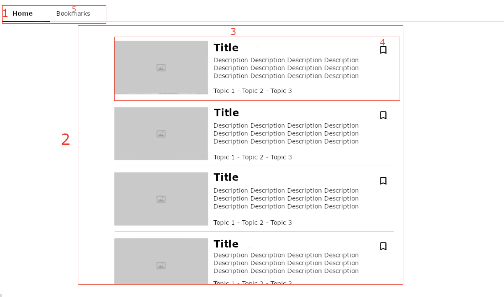

Welcome to the Clio React test. The following exercise contains a small design that you can use for reference and a few points that explains the requirements of the solution. You can work on each step in the order that you prefer.

## Reference design

## Exercise steps
1. Notice that under app/public you can find a file called get.json. Fetch and use the data on that json file to build your implementation.

2. Build a small menu with two entries: “Home” and “Bookmarks”. These two entries should give access to two different pages and the user should be able to switch between the two by clicking on the menu. (ref 1 in the design)

3. Under the “Home” page, build a component that displays a list of cards based on the data you have retrieved in point one. (ref 2)

4. Each card should be composed of (ref 3) an image, a title, a description, a sub list of topics and a bookmark button. You do not have to make it look pretty as long as it is functional.

5. The user should be able to add and remove the movies to his bookmarks. To do so, he can click on the bookmark button (ref 4). The button should change state based on the movie being bookmarked or not. Normally you would save the state to the server but for this exercise you can keep the state locally as long as the application works.

6. The user should be able to click on the bookmarks in the top menu (ref 5) and show a list similar to the “Home” page but where only the bookmarks he saved are showed, ordered by latest bookmarked